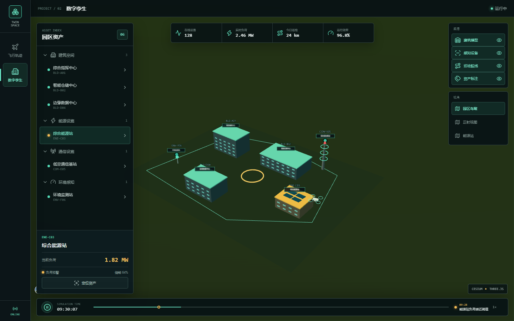
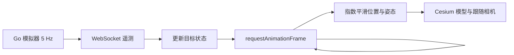
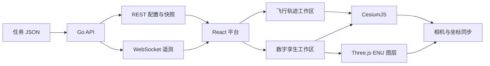

<h1 align="center">TwinSpace</h1>

<p align="center"><strong>CesiumJS + Three.js 多项目三维空间与数字孪生平台</strong></p>

<p align="center">
  <a href="https://github.com/lien0219/3D-Scene-Flight-Trajectory-of-UAV/actions/workflows/ci.yml"></a>
  <a href="LICENSE"></a>
  <a href="api/go.mod"></a>
  <a href="web/package.json"></a>
  <a href="web/package.json"></a>
  <a href="web/package.json"></a>
</p>

TwinSpace 是一个面向三维地理可视化与数字孪生场景的开源多项目平台。项目将 CesiumJS 的全球地理空间能力与 Three.js 的本地三维建模能力组合在同一画布坐标体系中，并提供可运行的无人机飞行轨迹与低空园区数字孪生示例。

平台采用 React + TypeScript 构建交互界面，Go 服务提供任务配置、飞行模拟和 WebSocket 实时遥测。它适合作为三维 GIS、低空经济、园区可视化、数字孪生和实时数据驱动场景的学习项目或二次开发基础。

> [!IMPORTANT]
> 本项目用于可视化、教学、原型和仿真演示，不包含真实飞控、自动避障、空域审批、适航认证或安全关键决策能力，不应直接用于控制真实航空器或生产设备。



## 在线能力概览

### 多项目工作台

- 统一的平台导航与项目上下文，支持工作区即时切换。
- 通过 `?project=digital-twin` 深链进入指定项目，刷新后保持当前工作区。
- 桌面与移动端响应式布局，控制面板不会挤压或遮挡核心三维场景。

### 无人机飞行轨迹

- Go 后端模拟多架无人机沿独立任务航线持续飞行。
- 5 Hz WebSocket 全量遥测，浏览器逐帧平滑插值位置与姿态。
- CesiumJS 2D/3D 场景、航线与航点、模型标签和实时 HUD。
- 追尾、俯瞰和自由视角，以及晴天、大雾和阴天场景效果。
- 外部 JSON 任务文件，可扩展无人机、颜色、速度和航点。

### 园区数字孪生

- CesiumJS 提供地理底座、园区边界、空间标注和巡检航线。
- Three.js 使用 ENU 本地坐标系渲染建筑、能源站、通信基站、环境传感器和巡检无人机。
- 两个引擎同步相机位置、方向、视场角和画布尺寸，实现空间贴合。
- 资产目录、状态高亮、设备指标、图层开关和资产聚焦。
- 鸟瞰、正射和能源站视角，以及可暂停的巡检仿真时间轴。

## 无人机平滑算法

后端默认以 5 Hz 推送无人机位置与姿态，而浏览器通常以 60 FPS 渲染。如果直接把每条遥测写入模型，画面会每 200 ms 跳动一次。TwinSpace 在每个渲染帧使用与帧率无关的指数平滑，将低频网络目标连续转换为 Cesium 模型状态。



每帧的平滑系数与状态更新公式为：

```text
alpha = 1 - exp(-k * deltaTime)
current = current + (target - current) * alpha
```

其中 `deltaTime` 是当前帧间隔（秒），无人机状态的响应系数 `k = 8`。指数形式使相同时间内的收敛结果基本不受 30 FPS、60 FPS 或 120 FPS 差异影响。经度、纬度、高度、俯仰角和横滚角使用该公式；航向角先计算 `[-180°, 180°]` 内的最短角差，避免从 `350°` 到 `10°` 时反向旋转 `340°`。

| 目标改变后的时间 | 已完成变化 | 剩余误差 |
| --- | ---: | ---: |
| 50 ms | 33.0% | 67.0% |
| 100 ms | 55.1% | 44.9% |
| 200 ms | 79.8% | 20.2% |
| 300 ms | 90.9% | 9.1% |
| 500 ms | 98.2% | 1.8% |

相机跟随采用相同原理，但使用较柔和的 `k = 5`，从而降低追尾和俯瞰视角中的视觉抖动。首次收到某架无人机数据时会直接初始化当前状态，避免模型从无效坐标缓慢飞入。完整推导、伪代码、角度环绕和参数选择见 [无人机平滑算法说明](docs/UAV_SMOOTHING.md)。

## 技术架构



| 层级 | 技术 | 职责 |
| --- | --- | --- |
| 平台 UI | React、TypeScript、Lucide | 项目导航、状态面板和交互控制 |
| 地理引擎 | CesiumJS、Resium | 影像、地理坐标、航线、实体和相机 |
| 三维引擎 | Three.js | 园区模型、设备、动画和本地空间图层 |
| 实时服务 | Go、Gorilla WebSocket | 任务校验、飞行模拟、状态快照和广播 |
| 工程化 | Vite、Vitest、Playwright | 构建、单元测试和跨视口场景回归 |

详细模块边界和双引擎同步方法见 [架构说明](docs/ARCHITECTURE.md)。

## 快速开始

### 环境要求

- Go 1.22 或更高版本
- Node.js 20 或更高版本
- pnpm 10

### 本地开发

克隆仓库并安装前端依赖：

```bash
git clone https://github.com/lien0219/3D-Scene-Flight-Trajectory-of-UAV.git
cd 3D-Scene-Flight-Trajectory-of-UAV/web
pnpm install --frozen-lockfile
```

终端 1，启动实时遥测 API：

```bash
cd api
go run .
```

终端 2，启动 Web：

```bash
cd web
pnpm dev
```

默认访问地址：

- 平台入口：<http://127.0.0.1:5173/>
- 数字孪生：<http://127.0.0.1:5173/?project=digital-twin>
- API 健康检查：<http://127.0.0.1:8080/healthz>

如果 `5173` 已被占用，Vite 会选择其他可用端口。开发环境允许相同协议下的本机回环端口连接 WebSocket；生产域名仍执行精确 Origin 校验。

### Docker Compose

```bash
docker compose up --build
```

访问 <http://127.0.0.1:8088>。停止服务：

```bash
docker compose down
```

## 自定义无人机任务

复制并修改 [任务示例](examples/mission.example.json)，然后通过 `MISSION_FILE` 启动 API：

```bash
cd api
MISSION_FILE=../examples/mission.example.json go run .
```

PowerShell：

```powershell
cd api
$env:MISSION_FILE = "../examples/mission.example.json"
go run .
```

任务文件可以声明任意数量的无人机。每架无人机至少需要两个有效航点，完整字段与部署变量见 [配置指南](docs/CONFIGURATION.md)。

## API

当前 API 服务于飞行轨迹工作区；数字孪生示例资产暂由前端场景数据驱动。

| 方法 | 路径 | 说明 |
| --- | --- | --- |
| `GET` | `/healthz` | 服务健康检查 |
| `GET` | `/api/config` | 当前任务和无人机航线 |
| `GET` | `/api/state` | 当前无人机遥测快照 |
| `GET` | `/ws` | 实时遥测 WebSocket |

请求与消息字段见 [API 文档](docs/API.md)。

## 项目结构

```text
.
├── api/                         # Go 模拟与实时遥测服务
│   ├── config/                  # 运行配置、任务加载和校验
│   ├── handler/                 # HTTP handler 与 WebSocket Hub
│   ├── model/                   # 后端数据模型
│   ├── router/                  # 路由、CORS 和 Origin 策略
│   └── simulator/               # 飞行推进与地理计算
├── web/                         # React 多项目三维平台
│   └── src/
│       ├── components/          # 平台、飞行轨迹和数字孪生组件
│       │   └── twin/            # Cesium + Three.js 双引擎场景
│       ├── config/              # 浏览器运行地址解析
│       ├── hooks/               # 任务与遥测接入
│       ├── lib/                 # 插值、负载校验和项目路由
│       └── types/               # TypeScript 契约
├── docs/                        # 架构、API、配置和扩展文档
├── examples/                    # 可运行任务示例
├── .github/                     # CI、Issue 与 Pull Request 模板
└── compose.yaml                 # 本地容器编排
```

## 质量检查

```bash
cd api
go test ./...
go vet ./...

cd ../web
pnpm check
pnpm test
pnpm build
pnpm lint:md
pnpm exec playwright install chromium
pnpm test:e2e
```

也可以从仓库根目录运行 `make check`。端到端测试会验证桌面与移动端、实时遥测、非空 WebGL 画布、项目深链、资产交互和相机视角变化。

## 文档

- [架构说明](docs/ARCHITECTURE.md)：运行时数据流、模块边界与双引擎同步
- [配置指南](docs/CONFIGURATION.md)：环境变量、任务格式与部署方式
- [API 文档](docs/API.md)：REST 与 WebSocket 契约
- [无人机平滑算法](docs/UAV_SMOOTHING.md)：逐帧指数平滑、角度插值与参数原理
- [扩展指南](docs/EXTENDING.md)：新增工作区、资产类型、数据源和模型
- [路线图](ROADMAP.md)：近期计划与范围边界
- [变更记录](CHANGELOG.md)：版本演进与未发布内容

## 参与贡献

欢迎通过 Issue 报告缺陷、提出场景需求，或提交 Pull Request。开始前请阅读 [贡献指南](CONTRIBUTING.md) 和 [行为准则](CODE_OF_CONDUCT.md)。安全问题请按 [安全策略](SECURITY.md) 私下报告。

新增模型、图片、地图数据或示例数据时，必须提供可核验的来源与许可证，并更新 [第三方声明](THIRD_PARTY_NOTICES.md)。

## 许可证

项目源代码及项目自制三维模型采用 [MIT License](LICENSE)。地图影像、运行时地图服务和第三方依赖仍受各自条款约束，不随仓库 MIT 许可证重新授权。分发或商用前请阅读 [第三方声明](THIRD_PARTY_NOTICES.md)。
