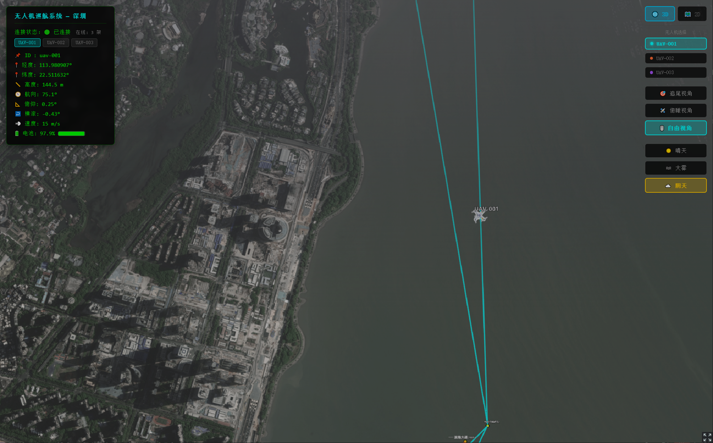

# 🛸 3D Scene Flight Trajectory of UAV

> **基于 CesiumJS + React + Go 的三维无人机编队实时巡航轨迹可视化系统**

本项目实现了一个在真实三维地理场景中，多架无人机同时沿预设航线自主巡航、实时数据推送、前端平滑渲染的完整解决方案。以深圳市区为场景，模拟 3 架无人机在不同航线上同步飞行，并在浏览器中以 60fps 进行流畅的三维可视化展示。


---

## 📑 目录

- [项目概述](#项目概述)
- [效果展示](#效果展示)
- [技术架构](#技术架构)
- [核心技术方案](#核心技术方案)
- [实现原理详解](#实现原理详解)
- [亮点与特色](#亮点与特色)
- [解决的技术难点](#解决的技术难点)
- [项目结构](#项目结构)
- [快速启动](#快速启动)
- [技术栈](#技术栈)

---

## 项目概述

本系统是一个**全栈实时三维可视化**项目，核心目标是在浏览器中以高帧率、低延迟地展示多架无人机的实时飞行状态。系统采用前后端分离架构：

- **后端**（Go）：负责多无人机飞行模拟、航线解算、状态推算，并通过 WebSocket 以 200ms 间隔向所有客户端广播编队状态
- **前端**（React + CesiumJS）：基于 Cesium 三维地球引擎，实时接收数据并以 60fps 帧级插值渲染，实现飞行器 3D 模型的平滑运动、相机智能跟随、多航线可视化、HUD 飞行仪表等功能


---

## 效果展示

### 三维场景巡航
全场景高德卫星影像底图，3D 无人机模型沿航线平滑飞行，航点标注、地标注记完整呈现。



### 多视角与天气系统
支持追尾视角、俯瞰视角、自由漫游三种相机模式，以及晴天、大雾、阴天三种天气效果切换。


---

## 技术架构

```
┌─────────────────────────────────────────────────────────┐
│                     Browser (Client)                     │
│  ┌─────────────┐  ┌──────────────┐  ┌────────────────┐  │
│  │  CesiumJS   │  │  React 18    │  │  WebSocket     │  │
│  │  3D Engine  │  │  Components  │  │  Client Hook   │  │
│  │  + Resium   │  │  (HUD/Scene) │  │  (useDroneWS)  │  │
│  └──────┬──────┘  └──────┬───────┘  └───────┬────────┘  │
│         │                │                   │           │
│         └────────────────┴───────────────────┘           │
│                          │  60fps rAF Loop               │
│                  ┌───────┴────────┐                      │
│                  │ DroneInterpolator│ ← 帧级平滑插值引擎  │
│                  └───────┬────────┘                      │
└──────────────────────────┼──────────────────────────────┘
                           │ WebSocket (JSON)
                           │ 200ms / tick
┌──────────────────────────┼──────────────────────────────┐
│                     Go API Server                        │
│  ┌──────────────┐  ┌─────┴──────┐  ┌─────────────────┐  │
│  │   Router     │  │  WS Hub    │  │  FlightSimulator│  │
│  │  (net/http)  │  │ (broadcast)│  │  × 3 (多机)     │  │
│  │  + CORS      │  │            │  │  航线解算/状态   │  │
│  └──────────────┘  └────────────┘  └─────────────────┘  │
└─────────────────────────────────────────────────────────┘
```

---

## 核心技术方案

### 1. 后端 — Go WebSocket 实时推送服务

| 模块 | 文件 | 职责 |
|------|------|------|
| **入口** | `api/main.go` | 启动 HTTP 服务，初始化 Hub 并开始广播 |
| **路由** | `api/router/router.go` | 注册 `/ws`（WebSocket）和 `/api/state`（REST 查询）接口，配置 CORS |
| **Hub** | `api/handler/ws.go` | 管理所有 WebSocket 连接；以 200ms 定时器驱动 Tick，将所有无人机状态序列化为 JSON 数组广播 |
| **飞行模拟器** | `api/simulator/flight.go` | 每架无人机独立模拟器，基于航点间 Haversine 距离进行进度推进、线性插值、航向解算 |
| **数据模型** | `api/model/drone.go` | 定义 `DroneState`（含经纬度、高度、航向、俯仰、横滚、速度、电量等）和 `Waypoint` |
| **配置** | `api/config/config.go` | 3 条真实深圳航线（共 33 个航点），各无人机速度/高度独立配置 |

**数据流**：`Ticker(200ms)` → 各 `FlightSimulator.Tick()` → 聚合为 `[]DroneState` → JSON → 广播至所有 WebSocket 客户端

### 2. 前端 — React + CesiumJS 三维可视化

| 模块 | 文件 | 职责 |
|------|------|------|
| **应用入口** | `web/src/App.tsx` | 组合 CesiumScene 与 HUD，管理选中无人机状态 |
| **WebSocket Hook** | `web/src/hooks/useDroneWS.ts` | 封装 WebSocket 连接、自动重连（3s）、多机状态解析 |
| **三维场景** | `web/src/components/CesiumViewer.tsx` | 核心渲染组件（667 行），包含插值引擎、相机控制、航线绘制、天气系统 |
| **飞行仪表** | `web/src/components/HUD.tsx` | 实时数据面板，显示经纬度/高度/速度/电量等 |
| **类型定义** | `web/src/types/drone.ts` | TypeScript 类型：`DroneState` / `DroneFleet` |

---

## 实现原理详解

### 🔄 后端飞行模拟引擎

飞行模拟器（`FlightSimulator`）为每架无人机维护独立状态，核心 Tick 逻辑：

1. **航段距离计算**：使用 **Haversine 公式**计算当前航点与下一航点间的地球表面距离
2. **进度推进**：`stepRatio = (speed × dt) / segmentDistance`，保证无论航段长短，无人机移动速度恒定
3. **位置插值**：经度、纬度、高度均使用线性插值 `lerp(from, to, progress)`
4. **航向解算**：使用 **Bearing（方位角）公式**，基于起终点经纬度计算真北航向角
5. **姿态模拟**：
   - **俯仰角（Pitch）**：根据前后航点高度差和距离，使用 `atan2` 计算攻角
   - **横滚角（Roll）**：使用正弦函数模拟飞行中的微小横滚抖动，增强真实感
6. **速度变化**：在航段起止 10% 区间内模拟加减速，符合真实飞行动力学
7. **电池衰减**：逐 Tick 线性衰减，耗尽后自动重置

### 🎯 前端帧级插值引擎（DroneInterpolator）

后端推送频率为 5Hz（200ms），而前端渲染需要 60fps。为了消除卡顿和跳变，设计了独立的 **指数衰减平滑插值器**：

```
current += (target - current) × (1 - e^(-speed × dt))
```

- `target`：WebSocket 最新数据
- `current`：当前渲染帧的插值状态
- `speed = 8`：插值追赶速度（越大越灵敏）
- `dt`：帧间隔时间（约 16.67ms）

**角度插值**额外处理了 0°/360° 跨越问题，确保航向平滑过渡不会出现反向旋转：

```typescript
function lerpAngleDeg(a, b, t) {
  let diff = b - a
  while (diff > 180) diff -= 360
  while (diff < -180) diff += 360
  return a + diff * t
}
```

整个插值引擎运行在 `requestAnimationFrame` 主循环中，每帧同时更新所有无人机的 6 个自由度（经度、纬度、高度、航向、俯仰、横滚）。

### 📷 智能相机跟随系统

相机跟随系统支持三种模式，均基于同一套平滑跟随框架：

| 模式 | 行为 | 实现 |
|------|------|------|
| **追尾视角（Chase）** | 相机位于无人机后方，随航向旋转 | 基于航向角计算偏移 `lng - sin(heading) × 0.003` |
| **俯瞰视角（Top）** | 正上方 800m 处向下俯视 | 位置直接叠加高度偏移，俯仰角 -80° |
| **自由视角（Free）** | 完全解锁，用户自主操控 | 跳过相机更新逻辑 |

相机位置本身也使用指数衰减插值（`speed=5`），确保视角切换时无突变、跟随时无抖动。

### 🌤️ 天气模拟系统

通过操控 Cesium Scene 的多层渲染参数实现三种天气效果：

- **晴天**：默认参数，全亮度卫星底图
- **大雾**：`fog.density=0.0008`，底图饱和度降至 0.3，叠加径向渐变 CSS 遮罩
- **阴天**：中等雾气密度，大气色相偏移 -0.04，线性渐变遮罩

### 🗺️ 高德卫星底图 + 地标注记

使用高德 `webst0{s}.is.autonavi.com` 卫星瓦片作为底图，支持 1~18 级缩放。在深圳市区标注了 **19 个地标**，按类型区分样式：

- **行政区**（金色/18px 粗体）：南山区、福田区、罗湖区、宝安区
- **兴趣点**（天蓝色/14px）：深圳湾公园、市民中心、世界之窗等
- **道路**（白色/13px 粗体）：深南大道、滨海大道、北环大道等

所有标注均配置 `NearFarScalar` 实现远近自适应缩放，避免标签堆叠。

---

## 亮点与特色

### ✨ 1. 多机编队同步仿真
同时模拟 **3 架无人机**在不同航线上独立飞行，后端为每架无人机维护独立模拟器实例，前端同时渲染 3 个 3D 模型，支持点击切换/快捷键选择。

### ✨ 2. 帧级平滑渲染（5Hz → 60fps）
后端仅以 5Hz 推送数据，前端通过自研 **指数衰减插值引擎** 将数据"膨胀"到 60fps，肉眼完全无法感知卡顿，动画如丝般顺滑。

### ✨ 3. 真实地理坐标与真实 3D 模型
- 所有航点均为深圳市真实经纬度坐标
- 无人机模型使用精细的 **glTF/GLB 格式 3D 模型**（含法线贴图和颜色纹理）
- 航向、俯仰、横滚完全基于物理公式计算，姿态真实自然

### ✨ 4. 军事级 HUD 飞行仪表
左上角实时显示选中无人机的完整飞行参数：经纬度（6 位小数）、高度、航向、俯仰角、横滚角、速度、电池电量（含进度条）。终端风格黑绿配色，信息密度高。

### ✨ 5. 沉浸式天气系统
不只是换个背景色——通过联动 Cesium 雾效/大气散射/底图亮度对比度饱和度 + CSS 遮罩层，实现高还原度的气象模拟。

### ✨ 6. 智能相机系统
追尾视角下相机自动跟随无人机航向旋转，带有平滑过渡。在 2D/3D 模式切换时自动调整相机参数，无缝衔接。

### ✨ 7. 2D/3D 一键切换
支持 Cesium 的 `SCENE3D` 与 `SCENE2D` 模式无缝切换，在 2D 模式下相机自动切换为垂直俯视，适合全局航线规划视角。

### ✨ 8. WebSocket 自动重连
前端 WebSocket 断开后自动 3 秒重连，确保长时间运行的稳定性。连接状态实时反馈在 HUD 面板上。

### ✨ 9. 高性能渲染优化
- 使用 Cesium `requestRenderMode` 按需渲染，降低 GPU 空闲功耗
- `CallbackProperty` 避免每帧创建新的 Cesium 对象
- 子组件 `DroneEntity` 使用 `useMemo` 缓存静态属性，防止无效 re-render
- `DroneInterpolator` 单例设计，跨组件共享无复制开销

---

## 解决的技术难点

### 🔥 难点 1：低频推送与高帧率渲染的矛盾

**问题**：后端 200ms 推送一次数据（5Hz），但前端需要 60fps（16.67ms/帧）渲染。如果直接使用 WS 数据，飞行器每 200ms 跳一次，体验极差。

**解决方案**：设计 `DroneInterpolator` 类，将 WS 数据作为插值目标（target），每帧以指数衰减函数将当前值（current）向目标趋近。这是一种**临界阻尼弹簧模型**的简化，既保证追赶速度，又无超调抖动。同时支持多架无人机独立插值，不会互相干扰。

### 🔥 难点 2：航向角跨越 0°/360° 时的反转问题

**问题**：无人机航向从 350° 变为 10°（向右转 20°），如果直接插值会走 340° 的大弧，导致模型疯狂反转。

**解决方案**：在 `lerpAngleDeg` 函数中先计算最短角度差（确保 diff ∈ [-180°, 180°]），再进行插值。同理 `lerpAngleRad` 处理弧度制角度。

### 🔥 难点 3：多无人机同时渲染的性能瓶颈

**问题**：3 架无人机 × 每帧更新位置和姿态 = 每帧 6 次 Cartesian3 计算 + 6 次 HeadingPitchRoll 四元数计算 + 相机更新，稍有不慎就掉帧。

**解决方案**：
- 使用 Cesium `CallbackProperty` 直接在渲染回调中读取插值结果，**零分配**
- 将 `DroneEntity` 拆为独立子组件，利用 React 组件边界隔离 re-render
- 将无关渲染的常量（模型 URI、比例、标签样式等）提取为模块级 `ConstantProperty`，全应用共享

### 🔥 难点 4：相机平滑跟随与用户自由操控的冲突

**问题**：在追尾/俯瞰模式下相机需要自动跟随无人机，但用户也可能想用鼠标拖拽查看其他区域，两者互相干扰。

**解决方案**：提供明确的"自由视角"模式，切换后完全停止相机自动更新。在跟随模式下，相机目标位置也使用独立的平滑插值（`speed=5`），即使数据突变也不会导致镜头突跳。

### 🔥 难点 5：Cesium 与 React 生命周期的协调

**问题**：Cesium Viewer 是命令式 API，React 是声明式框架，两者生命周期不同步容易导致内存泄漏或状态不一致。

**解决方案**：
- 使用 `resium`（React-Cesium 绑定库）处理基础声明式渲染
- 对需要精细控制的部分（相机、天气、插值循环），通过 `useRef` 持有 Viewer 实例，在 `useEffect` 中手动管理
- `rAF` 循环在 `useEffect` 返回的清理函数中取消，确保组件卸载时无悬挂回调

---

## 项目结构

```
3D-Scene-Flight-Trajectory-of-UAV/
├── api/                          # Go 后端服务
│   ├── main.go                   # 入口：启动服务 & 广播
│   ├── config/
│   │   └── config.go             # 航线配置（3 条航线/33 航点）、广播间隔、端口
│   ├── handler/
│   │   └── ws.go                 # WebSocket Hub：连接管理 & 状态广播
│   ├── model/
│   │   └── drone.go              # 数据模型：DroneState / Waypoint
│   ├── router/
│   │   └── router.go             # HTTP 路由 & CORS 配置
│   ├── simulator/
│   │   └── flight.go             # 飞行模拟器：Haversine / Bearing / 插值
│   ├── go.mod
│   └── go.sum
│
├── web/                          # React 前端应用
│   ├── index.html
│   ├── package.json              # 依赖：React 18 / CesiumJS / Resium / Vite
│   ├── vite.config.ts            # Vite 配置 + Cesium 插件 + WS 代理
│   ├── tsconfig.json
│   └── src/
│       ├── main.tsx              # 应用入口
│       ├── App.tsx               # 顶层组件：组合 Scene + HUD
│       ├── components/
│       │   ├── CesiumViewer.tsx   # 核心：3D 场景 / 插值引擎 / 相机 / 天气
│       │   └── HUD.tsx           # 飞行仪表面板
│       ├── hooks/
│       │   └── useDroneWS.ts     # WebSocket 连接 Hook（自动重连）
│       ├── types/
│       │   ├── drone.ts          # TypeScript 类型定义
│       │   └── assets.d.ts       # 静态资源类型声明
│       ├── styles/
│       │   └── index.css         # 全局样式
│       └── img/
│           ├── 10487538/         # 无人机 3D 模型（GLB + FBX + 贴图）
│           └── default/          # 项目截图素材
│
└── README.md                     # 本文档
```

---

## 快速启动

### 环境要求

- **Go** ≥ 1.22
- **Node.js** ≥ 18
- **pnpm**（或 npm）

### 1. 启动后端

```bash
cd api
go mod tidy
go run main.go
```

服务将在 `http://localhost:8080` 启动，WebSocket 端点为 `/ws`。

### 2. 启动前端

```bash
cd web
pnpm install
pnpm dev
```

浏览器访问 `http://localhost:5173`，即可看到三维场景和飞行中的无人机编队。

---

## 技术栈

| 层级 | 技术 | 版本 | 用途 |
|------|------|------|------|
| **3D 引擎** | CesiumJS | ^1.124 | 三维地球渲染、地形、影像、实体管理 |
| **React 绑定** | Resium | 1.18.2 | CesiumJS 的 React 声明式封装 |
| **前端框架** | React | ^18.3 | UI 组件、状态管理、Hooks |
| **构建工具** | Vite | ^6.0 | 开发服务器、HMR、打包 |
| **类型系统** | TypeScript | ^5.6 | 静态类型检查 |
| **后端语言** | Go | 1.22 | 高性能并发服务 |
| **WebSocket** | gorilla/websocket | 1.5.1 | WebSocket 协议实现 |
| **跨域** | rs/cors | 1.10.1 | CORS 中间件 |
| **底图** | 高德卫星瓦片 | — | 真实卫星影像 |
| **3D 模型** | glTF/GLB | — | 精细无人机模型（含纹理） |

---

<p align="center">
  <b>🚀 Made with CesiumJS + React + Go</b>
</p>
