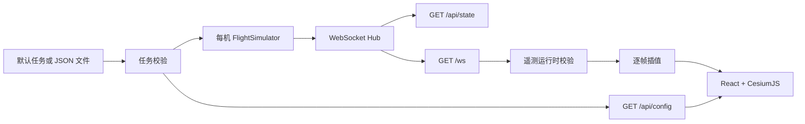

# 架构说明

## 目标与边界

系统将“遥测产生”和“三维展示”分离：API 负责产生、保存和广播当前状态，Web 负责连接、校验、插值和渲染。当前内置数据源是确定结构的飞行模拟器，不包含真实飞控能力。

设计目标：

- 任务数据单一来源，前后端不重复维护航线。
- 网络更新频率与渲染频率解耦。
- 运行配置与业务任务分离。
- HTTP/WebSocket 契约可测试，部署方式可替换。

## 运行时数据流

1. `config.LoadRuntime` 从环境变量读取监听地址、更新间隔、来源白名单和任务文件路径。
2. `config.LoadMission` 加载内置任务或 JSON 文件，并在启动前执行失败关闭校验。
3. `handler.Hub` 为每架无人机创建一个 `FlightSimulator`，按固定间隔推进状态。
4. Hub 将同一份状态通过 WebSocket 广播，并通过 REST 暴露快照。
5. Web 首先获取 `/api/config` 绘制航线，再连接 `/ws` 接收遥测。
6. `parseDronePayload` 校验外部数据，`DroneInterpolator` 将低频目标状态平滑到渲染帧率。

## 后端模块

| 模块 | 职责 | 扩展约束 |
| --- | --- | --- |
| `api/config` | 运行参数、内置任务、JSON 加载和校验 | 新字段应保持 JSON 向后兼容并增加校验测试 |
| `api/simulator` | 距离、方位角、航段推进和状态生成 | 不应依赖 HTTP 或 WebSocket |
| `api/handler` | 客户端管理、广播和响应编码 | 慢客户端策略和消息格式属于公共契约 |
| `api/router` | 路由、方法限制、CORS | 新端点需加入 `docs/API.md` 和契约测试 |
| `api/model` | 遥测和航点结构 | JSON 字段改名属于破坏性变更 |

## 前端模块

| 模块 | 职责 | 扩展约束 |
| --- | --- | --- |
| `web/src/config` | API 和 WebSocket 地址推导 | 默认使用同源地址，便于反向代理 |
| `web/src/hooks` | 连接生命周期和 React 状态 | 副作用必须在卸载时取消 |
| `web/src/lib` | 无框架数据处理 | 优先保持纯函数并提供单元测试 |
| `web/src/components` | HUD、场景和交互 | Cesium 命令式资源需明确创建和清理时机 |
| `web/src/types` | 浏览器侧接口契约 | 应与 API JSON 字段一致 |

## 关键设计决策

### 任务配置由 API 提供

航线曾同时硬编码于 Go 与 TypeScript，容易漂移。现在 API 的任务定义是唯一来源，Web 通过 `/api/config` 读取航线、名称和颜色。

### 同源部署优先

Web 默认连接当前页面的 `/api` 和 `/ws`。开发环境由 Vite 代理，容器环境由 Nginx 代理；只有跨域部署才需要 `VITE_API_BASE_URL` 或 `VITE_WS_URL`。

### 网络与渲染解耦

后端默认每 200 ms 推送一次。前端将最新消息作为目标状态，以指数衰减方式在 `requestAnimationFrame` 中追赶，从而避免直接使用 5 Hz 数据造成位置跳变。

### 任务在启动阶段严格校验

无人机 ID、速度、航点数量、经纬度、高度和有效航段会在 API 启动前校验。错误任务不会以部分可用状态启动。

## 已知限制

- Hub 当前逐连接同步写入；大规模连接应改为每客户端发送队列和背压策略。
- 遥测消息没有版本字段；新增破坏性字段前应引入协议版本。
- 场景地标和影像提供商仍属于前端静态配置。
- 默认使用椭球地形，航点高度不是贴地高度。
- 系统没有身份认证、持久化、审计或真实设备安全控制。
