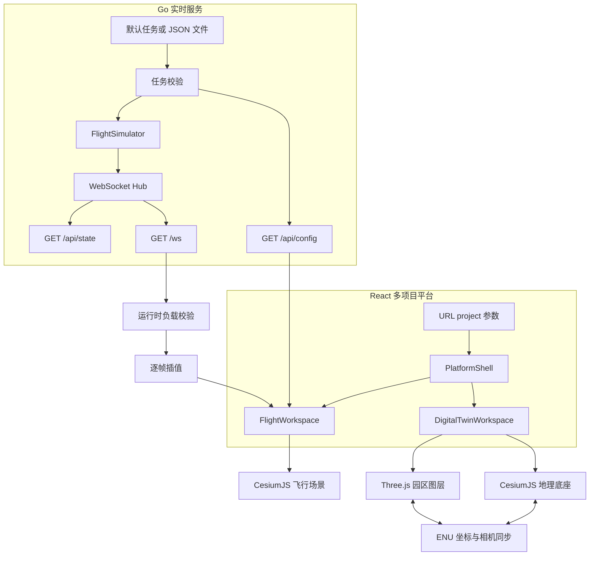

# 架构说明

## 系统定位

TwinSpace 是一个多工作区三维空间平台。平台层负责项目导航、URL 深链和响应式布局；工作区负责各自的场景、数据和交互。目前包含：

- **飞行轨迹工作区**：由 Go API 和 WebSocket 实时遥测驱动的 CesiumJS 场景。
- **数字孪生工作区**：CesiumJS 地理底座与 Three.js 园区模型叠加的双引擎场景。

系统仍保持“数据产生、平台编排、场景渲染”三层分离。内置数据用于仿真演示，不包含真实设备控制能力。

## 设计目标

- 一个应用承载多个可独立演进的三维项目工作区。
- 飞行任务由 API 提供，前后端不重复维护航线。
- 网络更新频率与浏览器渲染频率解耦。
- CesiumJS 与 Three.js 在同一地理参考系中稳定贴合。
- 工作区状态可深链、可刷新恢复，并适配桌面与移动端。
- HTTP、WebSocket、坐标转换和核心交互可自动验证。

## 总体结构



## 平台与项目路由

`App.tsx` 从 URL 的 `project` 查询参数解析当前工作区。`PlatformShell` 提供统一品牌、项目导航和运行状态，具体工作区只负责自己的场景内容。

当前项目 ID：

| 项目 | ID | 默认 URL |
| --- | --- | --- |
| 飞行轨迹 | `flight` | `/` |
| 数字孪生 | `digital-twin` | `/?project=digital-twin` |

`projectRoute.ts` 负责解析与生成 URL，保留其他查询参数和 hash。浏览器前进、后退会通过 `popstate` 恢复工作区。

## 飞行轨迹数据流

1. `config.LoadRuntime` 读取监听地址、更新间隔、Origin 白名单和任务路径。
2. `config.LoadMission` 加载内置任务或 UTF-8 JSON，并在启动前执行失败关闭校验。
3. `handler.Hub` 为每架无人机创建 `FlightSimulator`，默认每 200 ms 推进状态。
4. Hub 通过 `/ws` 广播完整机队状态，并通过 `/api/state` 暴露快照。
5. Web 从 `/api/config` 读取任务，再通过 `useDroneWS` 接收实时遥测。
6. `parseDronePayload` 校验消息，`DroneInterpolator` 将 5 Hz 目标状态平滑到浏览器帧率。
7. `CesiumViewer` 使用 `CallbackProperty` 更新模型位置和姿态，并按选中无人机更新相机。

逐帧指数平滑、航向角最短路径和相机响应参数见 [无人机平滑算法](UAV_SMOOTHING.md)。

## 数字孪生双引擎

### 引擎职责

| 引擎 | 职责 |
| --- | --- |
| CesiumJS | 地图影像、WGS84 坐标、园区范围、实体标注、巡检航线和地理相机 |
| Three.js | 建筑、能源设施、通信基站、环境设备、选择环和巡检无人机动画 |

CesiumJS 是相机与地理坐标的主引擎。Three.js 画布以透明方式覆盖在 Cesium 画布上，并设置 `pointer-events: none`，所有用户地图操作仍交给 Cesium。

### 坐标桥接

数字孪生场景在深圳示例位置定义 `TWIN_ORIGIN`。资产数据使用相对原点的东、北、高偏移：

```text
asset = { east, north, height }
```

Cesium 通过 `Transforms.eastNorthUpToFixedFrame` 构建原点的 ENU 到 ECEF 变换矩阵。每一帧将 Cesium 相机的世界坐标、方向和上向量转换回 ENU，再映射到 Three.js 坐标：

```text
Cesium ENU (east, north, up) -> Three.js (x=east, y=up, z=-north)
```

Three.js 相机同步以下参数：

- 位置 `positionWC`
- 方向 `directionWC`
- 上向量 `upWC`
- 垂直视场角 `frustum.fovy`
- 画布宽高与设备像素比

因此 Cesium 地理对象和 Three.js 本地模型可以在移动、缩放和预设视角切换时保持空间一致。

### 场景数据

`twinData.ts` 当前定义示例园区的：

- 地理原点与边界；
- 资产类型、尺寸、状态和指标；
- 巡检闭环路径；
- 鸟瞰、正射和能源站相机预设。

数字孪生资产目前是前端演示数据，不由 Go API 持久化。未来接入资产服务时应保持 `TwinAsset` 作为场景边界模型，并在进入 Three.js 前完成数据校验。

## 后端模块

| 模块 | 职责 | 扩展约束 |
| --- | --- | --- |
| `api/config` | 运行参数、内置任务、JSON 加载和校验 | 新字段应保持向后兼容并增加校验测试 |
| `api/simulator` | 距离、方位角、航段推进和状态生成 | 不依赖 HTTP 或 WebSocket |
| `api/handler` | 客户端管理、广播、Origin 判断和响应编码 | 消息格式和慢客户端策略属于公共契约 |
| `api/router` | 路由、方法限制和 CORS | 新端点需更新 API 文档与契约测试 |
| `api/model` | 遥测和航点结构 | JSON 字段改名属于破坏性变更 |

## 前端模块

| 模块 | 职责 | 扩展约束 |
| --- | --- | --- |
| `web/src/components/PlatformShell.tsx` | 平台品牌、项目切换和上下文 | 不包含工作区业务状态 |
| `web/src/components/FlightWorkspace.tsx` | 飞行遥测与 Cesium 场景编排 | 后端任务是航线单一来源 |
| `web/src/components/twin` | 数字孪生 UI、数据与双引擎渲染 | Three.js 资源必须在卸载时释放 |
| `web/src/config` | API 和 WebSocket 地址推导 | 默认同源，开发代理显式使用 IPv4 |
| `web/src/hooks` | 连接生命周期和 React 状态 | 副作用必须在卸载时取消 |
| `web/src/lib` | 插值、负载校验和项目路由 | 优先使用纯函数并提供单元测试 |
| `web/src/types` | 浏览器侧接口契约 | 与 API JSON 字段保持一致 |

## Origin 与本地开发

同源部署是推荐模式：Web 默认请求当前页面的 `/api` 和 `/ws`，开发环境由 Vite 代理，容器环境由 Nginx 代理。

生产 Origin 必须精确匹配 `ALLOWED_ORIGINS`。为兼容 Vite 在 `5173` 被占用时自动选择其他端口，后端只在白名单本身包含本机回环地址时，允许相同协议下的 `localhost`、`127.0.0.1` 或 `::1` 使用其他端口。该规则不会放宽外部域名。

## 资源生命周期

- `useDroneWS` 在卸载时关闭 WebSocket 并清理重连计时器。
- `CesiumViewer` 通过 React/Resium 生命周期管理实体和 Viewer。
- `ThreeTwinLayer` 在卸载时取消动画帧、断开 `ResizeObserver`，并释放 geometry、material、texture 和 renderer。
- 平台切换会卸载离开的工作区，避免两个大型场景同时占用 GPU。

## 已知限制

- 数字孪生资产和指标为前端示例数据，没有持久化、历史查询或服务端同步。
- Hub 当前逐连接同步写入，大规模连接需要发送队列和背压策略。
- 遥测消息没有协议版本，破坏性变更前应先引入版本字段。
- 默认影像提供商和地标属于静态配置，公开部署需自行确认许可和可用性。
- 默认使用椭球地形，飞行高度不是贴地高度。
- 系统没有身份认证、租户隔离、审计或真实设备安全控制。
