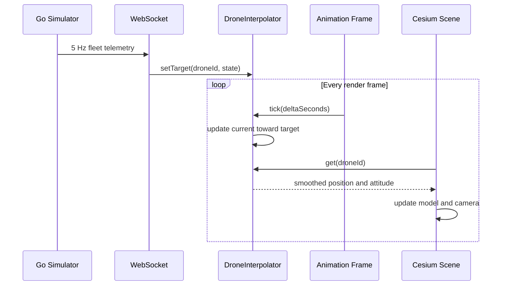

# 无人机平滑算法

本文说明 TwinSpace 如何将低频 WebSocket 遥测转换为连续的无人机位置、姿态和相机运动。这里的算法只负责前端视觉平滑，不预测未来轨迹，也不参与真实飞控或导航决策。

## 问题背景

Go 服务默认每 200 ms 广播一次完整机队状态，即遥测频率为 5 Hz。浏览器的 `requestAnimationFrame` 通常以 60 FPS 运行，两次网络消息之间大约会渲染 12 帧。

直接渲染最新遥测会产生以下现象：

- 无人机每 200 ms 瞬移到一个新位置；
- 航向、俯仰和横滚呈阶梯状变化；
- 跟随相机重复急停和追赶；
- 不同刷新率的屏幕表现不一致。

TwinSpace 将网络状态视为目标值，在每个渲染帧让显示状态以指数曲线逼近目标。

## 数据流



每架无人机保存两份状态：

- `target`：最近一条通过运行时校验的遥测；
- `current`：当前用于 Cesium 渲染的平滑状态。

首次收到无人机数据时，`current` 直接复制 `target`。后续消息只更新 `target`，`current` 由动画循环逐步追赶。

## 指数平滑原理

### 连续模型

设目标状态为 `x_target`，显示状态为 `x(t)`，一阶响应模型为：

```text
dx(t) / dt = k * (x_target - x(t))
```

`k` 是响应速度，单位为 `1/s`。目标不变时，该微分方程的解析解为：

```text
x(t + deltaTime) = x_target + (x(t) - x_target) * exp(-k * deltaTime)
```

整理后得到代码使用的逐帧形式：

```text
alpha = 1 - exp(-k * deltaTime)
x_next = x_current + (x_target - x_current) * alpha
```

位置和姿态默认使用 `k = 8`：

```ts
const alpha = 1 - Math.exp(-8 * deltaSeconds)
current.lng += (target.lng - current.lng) * alpha
current.lat += (target.lat - current.lat) * alpha
current.alt += (target.alt - current.alt) * alpha
```

实现位于 `web/src/lib/DroneInterpolator.ts`。

### 为什么不使用固定插值比例

如果每帧固定执行 `current += error * 0.1`，60 FPS 每秒更新 60 次，120 FPS 每秒更新 120 次，高刷新率设备会更快接近目标。指数系数把真实帧间隔包含在计算中。

在总时间相同的情况下，多帧组合后的剩余误差为：

```text
error(t) = error(0) * exp(-k * t)
```

因此渲染帧率变化只改变采样密度，不会改变理论响应速度。这也是算法“与帧率无关”的含义。

## 响应速度

`k = 8` 时，时间常数与半衰期为：

```text
timeConstant = 1 / k = 0.125 s
halfLife = ln(2) / k = 0.0866 s
```

目标发生阶跃变化后的理论响应如下：

| 时间 | 已完成变化 `1 - exp(-8t)` | 剩余误差 `exp(-8t)` |
| --- | ---: | ---: |
| 16.7 ms | 12.5% | 87.5% |
| 50 ms | 33.0% | 67.0% |
| 100 ms | 55.1% | 44.9% |
| 200 ms | 79.8% | 20.2% |
| 300 ms | 90.9% | 9.1% |
| 500 ms | 98.2% | 1.8% |

在下一条 5 Hz 遥测到达前，显示状态通常已经完成约 80% 的变化。连续移动时，目标也会持续前进，因此算法表现为稳定、有限的视觉跟随延迟，而不是每次都完全停在目标点。

## 航向角最短路径

普通数值插值不能直接处理角度环绕。例如从 `350°` 转到 `10°`：

```text
directDifference = 10 - 350 = -340 degrees
shortestDifference = +20 degrees
```

若直接使用 `-340°`，模型会沿错误方向几乎旋转一整圈。算法将角差规范到 `[-180°, 180°]`：

```text
delta = target - current
while delta > 180: delta -= 360
while delta < -180: delta += 360
next = current + delta * alpha
```

弧度版本使用 `[-PI, PI]`，用于相机 heading。角度可以暂时得到 `360°` 等等价值，Cesium 渲染时与 `0°` 方向相同。

## 渲染循环

`CesiumViewer.tsx` 在动画循环中计算帧间隔，并限制单帧最大步长：

```ts
const deltaSeconds = Math.min((now - lastTime) / 1000, 0.05)
interpolator.tick(deltaSeconds)
```

`0.05 s` 上限避免浏览器标签页恢复、断点调试或主线程长时间阻塞后出现过大的单帧跃迁。随后 Cesium 的 `CallbackProperty` 从插值器读取当前位置与姿态，并显式请求场景重绘。

## 相机平滑

追尾和俯瞰相机会根据选中无人机计算目标位置，再使用相同的一阶指数响应：

```text
cameraAlpha = 1 - exp(-5 * deltaTime)
cameraNext = cameraCurrent + (cameraTarget - cameraCurrent) * cameraAlpha
```

相机使用 `k = 5`，比无人机的 `k = 8` 更柔和。这样既能跟随飞行，又不会把每个遥测修正直接放大成镜头抖动。自由视角不执行跟随更新，用户可以独立操作 Cesium 相机。

## 参数选择

| 参数 | 当前值 | 作用 |
| --- | ---: | --- |
| 遥测间隔 | 200 ms | Go 服务默认广播间隔 |
| 无人机响应系数 | `k = 8` | 控制位置与姿态的跟随速度 |
| 相机响应系数 | `k = 5` | 提供更柔和的镜头运动 |
| 最大帧步长 | 50 ms | 限制长帧后的单次状态变化 |

调高 `k` 会减小延迟，但更容易暴露遥测噪声；调低 `k` 会增加平滑程度，也会产生更明显的滞后。参数应结合遥测频率、网络抖动、场景尺度和产品对延迟的容忍度调整，并通过不同刷新率和断线恢复场景验证。

## 能力边界

一阶指数平滑简单、稳定，适合当前演示规模，但它不会估计速度、加速度或网络时延：

- 它只逼近最近目标，不外推下一时刻位置；
- 遥测长时间中断时，模型会停在最后目标附近；
- GPS 跳点仍会形成可见的平滑位移；
- 它不能替代时间戳缓冲、轨迹重采样、卡尔曼滤波或飞控状态估计。

需要更严格的实时回放时，可以基于服务端时间戳维护短时状态缓冲，并在固定延迟窗口内做位置插值与姿态球面插值。接入真实设备前还必须单独处理数据质量、时钟同步、异常值、认证和安全隔离。

## 测试覆盖

`web/src/lib/DroneInterpolator.test.ts` 当前验证：

- 首条遥测立即初始化显示状态；
- 新目标到达后，位置逐步收敛且不会一步跳到目标；
- `350° -> 10°` 通过最短方向跨越角度边界；
- 角度与弧度插值保持一致的环绕语义。

修改算法时至少运行：

```bash
cd web
pnpm test
pnpm check
```
